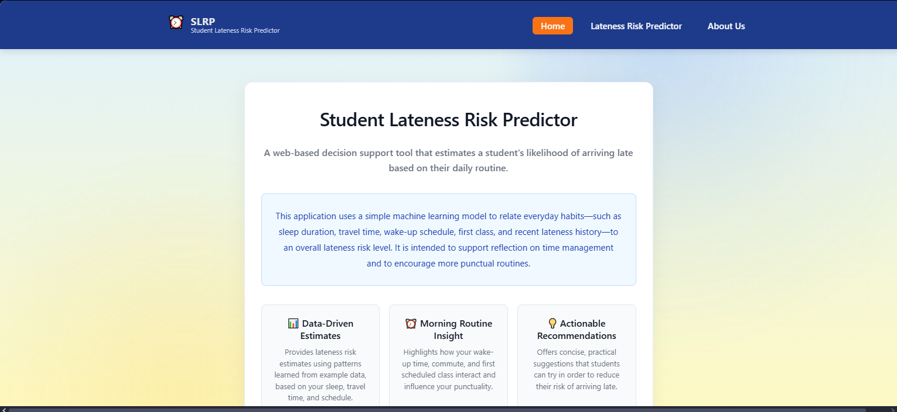
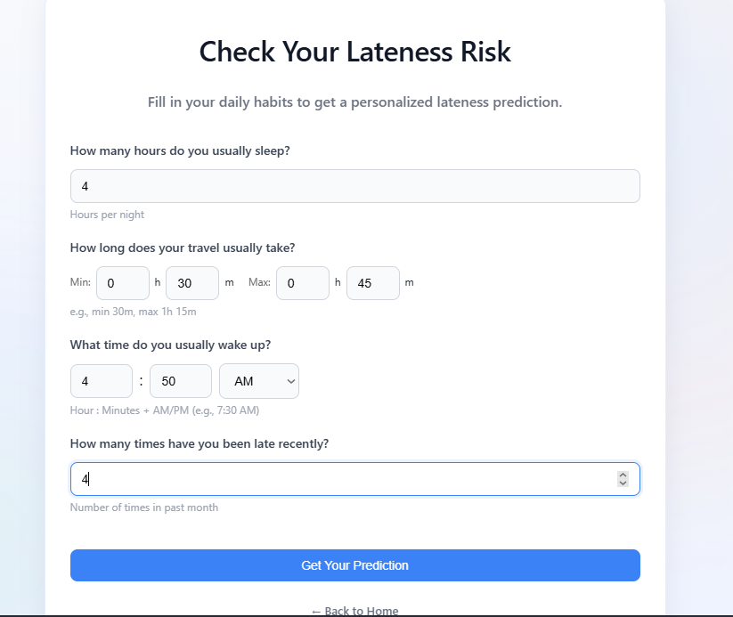
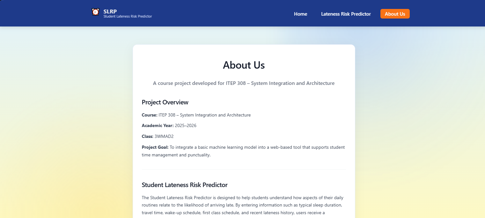
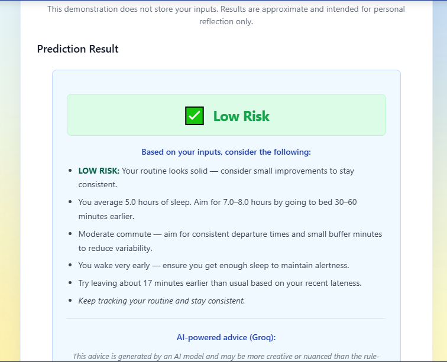
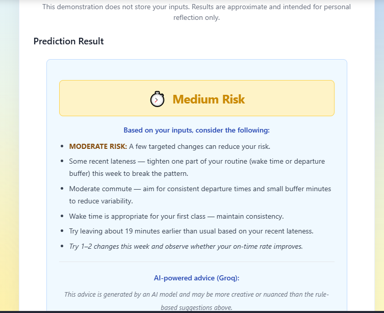
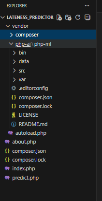
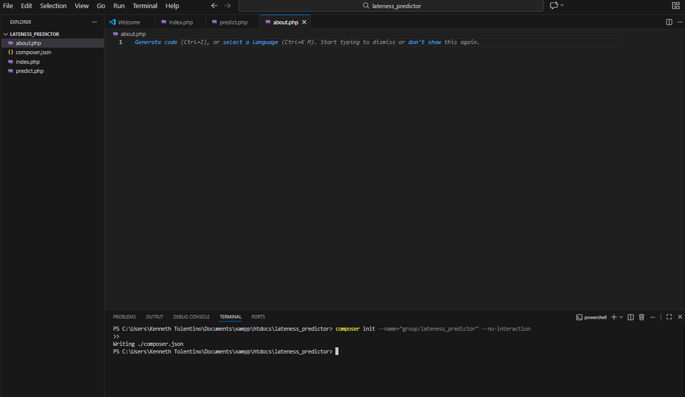
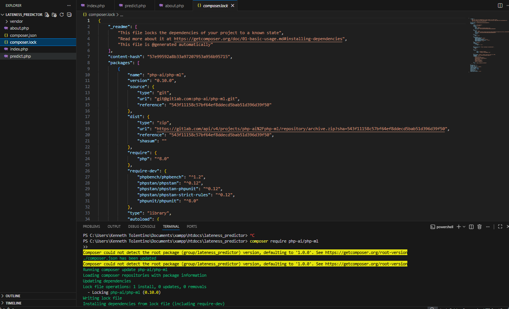

# Student Lateness Risk Predictor

A simple ML-powered web tool (PHP + php-ml) that predicts how likely a student is to be late based on daily habits. This repository contains a demo that uses synthetic/example data for illustration.

---


## Important Instructions

1. **How to Run Locally**
   - Requirements: PHP (version X+), Composer, web server (e.g., XAMPP).
   - Clone the repo:  
     ```
     git clone https://github.com/yourusername/lateness_predictor.git
     ```
   - Install dependencies:  
     ```
     composer install
     ```
   - Place the project folder in your web server's root directory (e.g., `htdocs` for XAMPP).
   - Start your web server and visit:  
     ```
     http://localhost/lateness_predictor
     ```

2. **How to Use the Web App**
   - Go to the deployed link: [http://slrp.free.nf](http://slrp.free.nf)
   - Enter your daily routine data in the form.
   - Submit to receive your lateness risk prediction and advice.

3. **Demo Data**
   - The app uses example/synthetic data for demonstration.
   - No login required.

4. **Screenshots & Links**
   - See the "Screenshots" section for example images.
   - All required submission links are listed below.

5. **Troubleshooting**
   - If you see errors, ensure all dependencies are installed and your PHP version is compatible.
   - For issues with Composer, run `composer install` again.

---

## Files & Structure

- `index.php` — Landing page
- `predict.php` — Form, input validation, model training/prediction, and advice generation
- `about.php` — Project description and team
- `style.css` — Styling
- `train.csv` — CSV training data (columns: sleep_hours,travel_mins,wake_hour,prev_lates first_class, label)
- `groq_ai.php` — Handles communication with the Groq AI API to generate lateness advice. Used for AI-powered feedback in the app.

---

## Design Thinking (brief)

- Hills:
        Hill 1:
        Enable students to receive a simple, ML-based lateness risk assessment using their daily routine inputs.
        Hill 2:
        Provide personalized advice based on sleep hours, travel time, wake-up time, and past lateness.
        Hill 3:
        Empower students to adjust their daily habits using understandable feedback and risk indicators.

- Sponsor user:  A college student who frequently arrives late and struggles with scheduling.

- Playback feedback: 
        1. Students found 24-hour input confusing -> added AM/PM + minutes; travel input too vague -> added min/max hours+ minutes range.

        2. Sponsor user requested personalized suggestions -> added dynamic and AI powered.


---

## Screenshots
The `screenshots/` folder contains example images used in the README. Below are the key screens (click to view full-size on GitHub):

Landing page


Prediction form (empty)


Prediction form (with values)


 About Us


Low risk example


Medium risk example


High risk example


Additional references

- Folder & composer: 
- Composer/terminal screenshots:  

---

## Links
- Deployed system: `http://slrp.free.nf`
- Video presentation (10-min): `https://youtu.be/jfHxKTN6fa4?si=UU6pzYppie6CFy4v`
- Slides (Canva/PowerPoint): `https://www.canva.com/design/DAG677rleUo/YdTvZf8dnDywMXlgRRLTRw/view?utm_content=DAG677rleUo&utm_campaign=designshare&utm_medium=link2&utm_source=uniquelinks&utlId=hbfc45a35b4`

---


